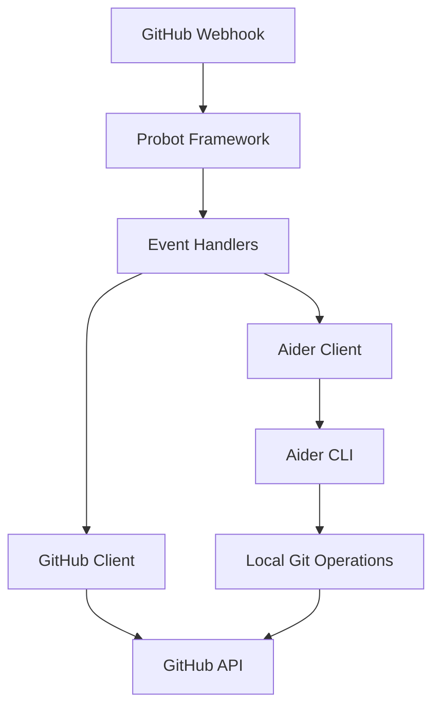

# System Patterns: Probot Aider Bot

## System Architecture

The Probot Aider Bot is built using a modular architecture with clear separation of concerns:

### Components

1. **Probot Framework**
   - Handles webhook registration and event routing
   - Manages authentication with GitHub API
   - Provides logging and error handling

2. **Event Handlers**
   - Process GitHub events (issues, labels)
   - Orchestrate the workflow between GitHub and Aider
   - Maintain state during the fix process

3. **GitHub Client**
   - Abstracts GitHub API interactions
   - Handles repository operations (clone, branch, PR)
   - Manages issue comments and labels

4. **Aider Client**
   - Integrates with the Aider CLI tool
   - Manages temporary working directories
   - Captures and processes Aider output

## Key Technical Decisions

1. **TypeScript for Type Safety**
   - Using TypeScript to ensure type safety and improve maintainability
   - Interfaces defined for all major data structures
   - Type checking for GitHub API responses

2. **Modular Design**
   - Clear separation between GitHub integration and Aider integration
   - Configuration isolated in a separate module
   - Each component has a single responsibility

3. **Promise-based Async Processing**
   - Asynchronous handling of GitHub events
   - Proper error propagation through promise chains
   - Cleanup of resources even during failures

4. **Temporary File Management**
   - Secure creation of temporary directories
   - Proper cleanup after operations
   - Isolation between concurrent operations

## Design Patterns in Use

1. **Dependency Injection**
   - Passing context objects to clients
   - Makes testing easier through mocking
   - Allows for configuration changes without code changes

2. **Factory Methods**
   - Creation of clients through factory methods
   - Consistent initialization of components
   - Centralized error handling during initialization

3. **Command Pattern**
   - Encapsulating Aider operations as commands
   - Standardized execution and result handling
   - Separation of command execution from result processing

4. **Adapter Pattern**
   - Adapting Aider CLI to programmatic interface
   - Standardizing error formats between systems
   - Translating between GitHub API and local operations

## Component Relationships

1. **Event Handler → GitHub Client**
   - Event handlers use GitHub client to interact with GitHub API
   - GitHub client provides repository information to event handlers
   - Event handlers process GitHub client results

2. **Event Handler → Aider Client**
   - Event handlers pass issue information to Aider client
   - Aider client returns fix results to event handlers
   - Event handlers use Aider client for temporary directory management

3. **Aider Client → Local Git**
   - Aider client uses local Git operations
   - Git operations are encapsulated within Aider client
   - Results of Git operations inform Aider client responses

4. **GitHub Client → GitHub API**
   - GitHub client translates app operations to API calls
   - API responses are processed and standardized
   - Error handling and rate limiting managed by GitHub client
